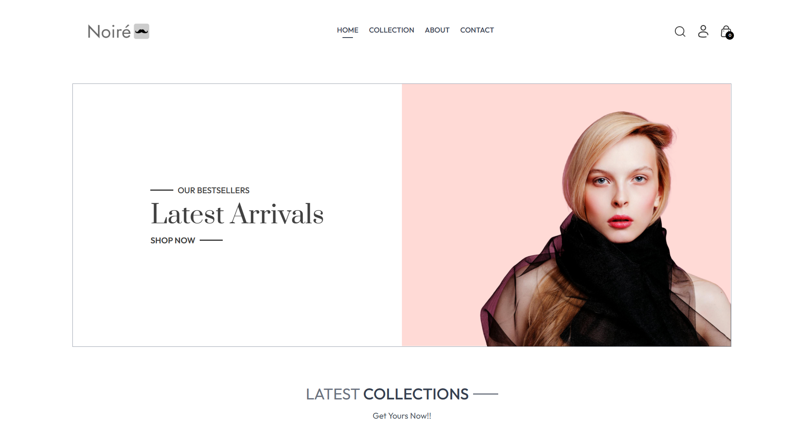
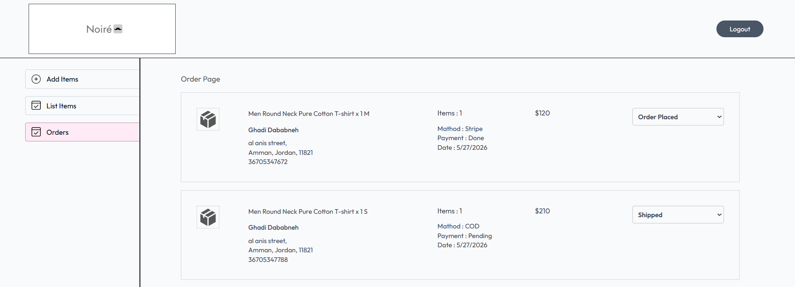
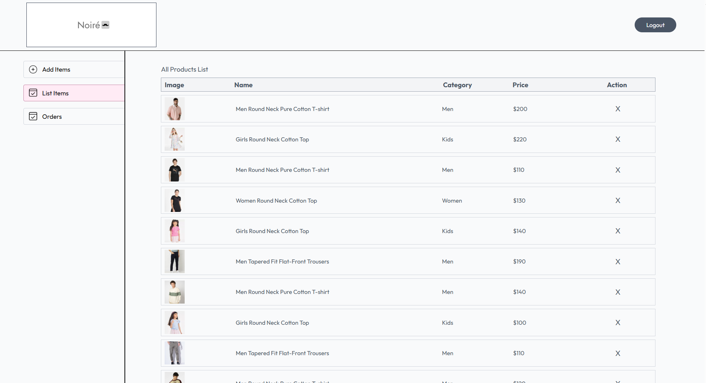
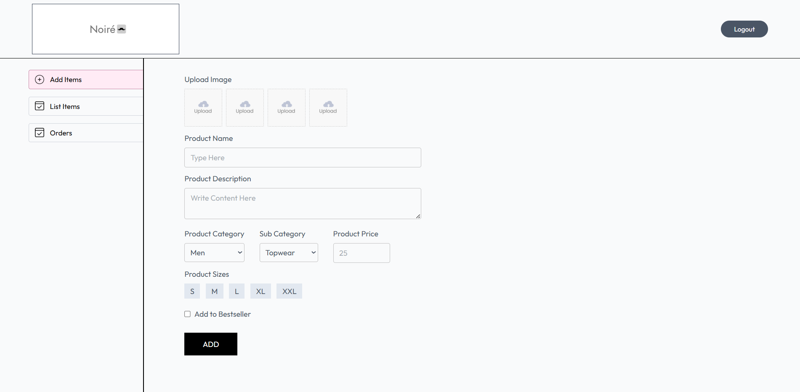

# Noiré — Full-Stack E-Commerce Platform 🛍️

A complete MERN e-commerce store where users browse, filter, and buy products, with a full
admin dashboard for managing the catalog and orders.



[](https://e-commerce-frontend-tau-tan.vercel.app/)
&nbsp;


## 🔗 Live

- **Storefront:** https://e-commerce-frontend-tau-tan.vercel.app/
- **Admin dashboard:** https://e-commerce-admin-eta-sable.vercel.app/ _(demo login on request)_
- **API:** https://e-commerce-backend-three-sooty.vercel.app/

> Stripe runs in **test mode**. To try card checkout, use `4242 4242 4242 4242` with any
> future expiry date and any CVC. No real charges are made.

## ✨ Features

**Shoppers**
- Browse, search, filter, and sort products
- Product variants (size selection) and a persistent cart
- Checkout with Stripe or cash on delivery
- Place orders with a delivery address and view order history

**Admin**
- Authenticated admin dashboard
- Add, edit, and delete products, with image upload
- View and manage all orders across the store

## 📸 Screenshots

| Orders | Products | Add product |
| --- | --- | --- |
|  |  |  |

The admin dashboard is credential-protected, so these show what the live link can't.

## 🧰 Tech Stack

| Layer | Technology |
| --- | --- |
| Frontend | React, React Router, Context API, Tailwind CSS, Vite |
| Backend | Node.js, Express.js |
| Database | MongoDB + Mongoose |
| Auth | JWT, bcrypt |
| Payments | Stripe Checkout (test mode), cash on delivery |
| Media | Cloudinary + Multer |
| Deployment | Vercel (storefront, admin, and API) |

## 🔒 Security Notes

Payment and order handling assume the client is untrusted:

- **Order totals are recomputed server-side.** Prices and amounts sent by the browser are
  ignored; every line item is looked up in the database and the total is calculated from
  stored prices, then used for both the saved order and the Stripe charge.
- **Stripe payments are verified against Stripe.** The checkout session ID is stored on the
  order, and an order is only marked paid after retrieving that session and confirming
  `payment_status === 'paid'`. The client's success flag alone proves nothing.
- **Order actions enforce ownership**, so one user cannot mark or delete another user's orders.
- **Admin sessions use a role claim** rather than embedding credentials in the token, and all
  tokens expire.
- **Login responses are generic**, so the API doesn't reveal which emails are registered.

## 🚀 Getting Started

**Prerequisites:** Node.js 18+, a MongoDB database, a Cloudinary account, and a Stripe
account (test keys are fine).

```bash
# clone
git clone https://github.com/Ghadiiz/E-commerce.git
cd E-commerce

# backend
cd backend && npm install && npm run server

# frontend (new terminal)
cd frontend && npm install && npm run dev

# admin (new terminal)
cd admin && npm install && npm run dev
```

Each folder has a `.env.example` — copy it to `.env` and fill in your own values.

### Environment variables

**`backend/.env`**

| Variable | Notes |
| --- | --- |
| `MONGODB_URI` | Cluster URI **without** a database name — the app appends `/e-commerce` itself |
| `JWT_SECRET` | Any long random string |
| `ADMIN_EMAIL` | Admin dashboard login |
| `ADMIN_PASSWORD` | Admin dashboard login |
| `CLOUDINARY_NAME` | Cloudinary cloud name |
| `CLOUDINARY_API_KEY` | Cloudinary API key |
| `CLOUDINARY_SECRET_KEY` | Cloudinary API secret |
| `STRIPE_SECRET_KEY` | Stripe secret key (`sk_test_...`) |

`PORT` is optional and defaults to `4000`.

**`frontend/.env`** and **`admin/.env`**

| Variable | Notes |
| --- | --- |
| `VITE_BACKEND_URL` | e.g. `http://localhost:4000` in development |

## 📁 Structure

```
E-commerce/
├── frontend/   # customer-facing store (React)
├── admin/      # admin dashboard (React)
└── backend/    # REST API (Node/Express/MongoDB)
```

## 👤 About

Built by **Ghadi Dababneh** to practice end-to-end MERN development — REST API design, auth,
state management, and deployment. Started from a MERN course foundation as a hands-on learning
project, then extended and hardened independently.

[GitHub](https://github.com/Ghadiiz) · [LinkedIn](https://www.linkedin.com/in/ghadi-dababneh-a203b9378/)

## 📄 License

MIT
